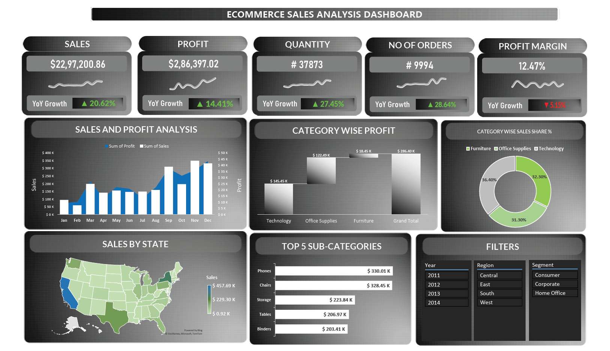

# 🛍️ E-commerce Sales Data Analysis using Excel

This project is focused on analyzing and visualizing an e-commerce company's sales performance using Microsoft Excel. It includes data cleaning, trend analysis, KPI calculation, and an interactive dashboard for better business insights.



---

### 📌 Project Objective
To understand:
- Overall sales and profit performance
- Customer behavior and product preferences
- Regional and category-wise profitability
- Year-over-Year (YoY) growth and trends

---

###  Sales & Profit Analysis

1. What is the total sales and total profit overall?
```
Total Sales: $2,297,200
Total Profit: $286,397
```
#### Conclusion:
The company generated $2.29 million in total sales and earned a profit of $286K, which means the overall profit margin is around 12.5%.

This shows the business is profitable, but there may be scope to improve margins by controlling discounts or operational costs.


2. Which year had the highest sales and profit?
| Year | Sales     | Profit   |
| ---- | --------- | -------- |
| 2011 | \$484,247 | \$45,543 |
| 2012 | \$470,532 | \$61,618 |
| 2013 | \$608,473 | \$81,726 |
| 2014 | \$733,947 | \$93,507 |

#### Conclusion:
The business saw steady profit growth from 2011 to 2014.
While sales slightly dropped in 2012, they increased significantly in 2013 and 2014.

2014 had the highest sales ($733K) and profit ($93.5K), making it the best-performing year overall.

This trend shows improved sales strategies and better cost management over time.

3. Which region performed the best in terms of sales and profit?
| Region  | Sales     | Profit    |
| ------- | --------- | --------- |
| Central | \$501,239 | \$39,706  |
| East    | \$678,781 | \$91,522  |
| South   | \$391,721 | \$46,749  |
| West    | \$725,457 | \$108,418 |

#### Conclusion:
The West region outperformed all others with the highest sales ($725K) and highest profit ($108K).
The East region also performed well, ranking second in both sales and profit.
This indicates that West and East regions are the strongest markets, while South and Central may need focused marketing or pricing strategies.

4. What is the Year-over-Year (YoY) Growth in Sales and Profit?
```
Sales Growth: 20.62%
Profit Growth: 14.41%
```
#### Conclusion:
The company achieved a YoY sales growth of 20.62%, showing strong improvement in revenue generation.

Profit grew by 14.41% YoY, which is positive but slightly slower than sales growth — suggesting a need to control costs or improve margins.

Overall, the upward trend reflects healthy business expansion.

5. Which product sub-category gave the highest profit?
| Category/Sub-Category | Profit    |
| --------------------- | --------- |
| Phones                | \$330.01K |
| Chairs                | \$328.45K |
| Storage               | \$223.84K |
| Tables                | \$206.97K |
| Binders               | \$203.41K |

#### Conclusion:
The Phones category generated the highest profit of $330K, closely followed by Chairs ($328K).

These two sub-categories are the top profit drivers for the business.
